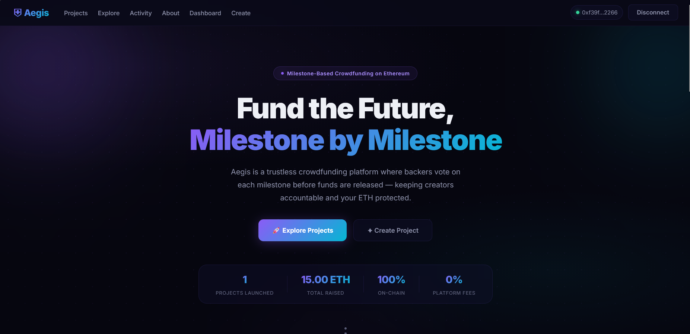
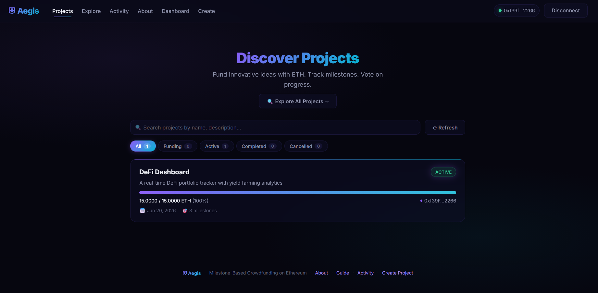
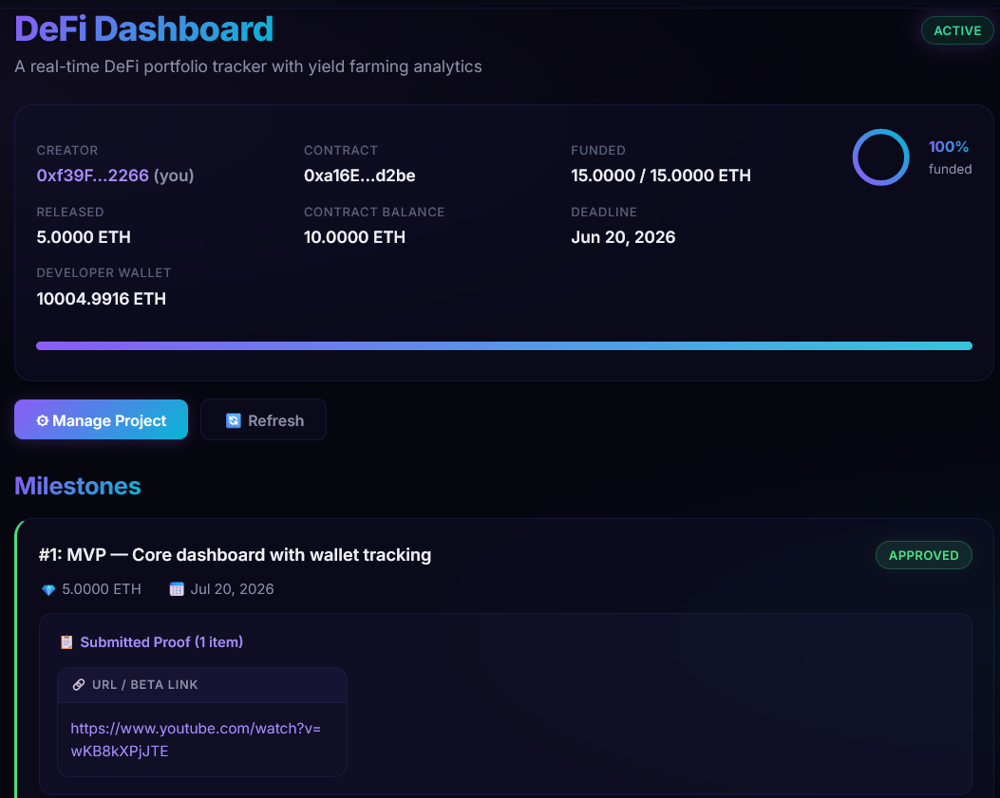

# Aegis: Crowdfunding Platform Appendix

This appendix contains supplementary materials for the paper *Aegis: Milestone-Based Crowdfunding on Ethereum with Contribution-Weighted Voting*.

## 🔗 Links and Resources

* **GitHub Repository (Source Code)**: [https://github.com/RifqiRamadhan-creator/Aegis---Blockchain](https://github.com/RifqiRamadhan-creator/Aegis---Blockchain)
* **Product Demo Video**: *Upcoming* (Under preparation)

## 📸 System Screenshots and Interface Mockups

Below are the screenshots illustrating the user interface design, dashboard, and transaction workflow of the Aegis platform.

### 1. Interface Mockup
This mockup illustrates the main crowdfunding landing page, showcasing campaign progress tracking, active milestones, and contributing interfaces.

### 2. User Dashboard
The dashboard displays creator statistics, active milestones, release summaries, and the contract balance of deployed campaigns.

### 3. Transaction Workflow
This screenshot displays MetaMask transaction confirmations and status logging for contribution-weighted voting and milestone fund releases.

